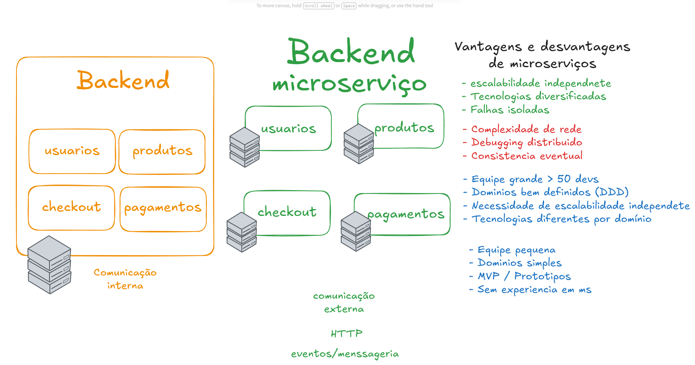
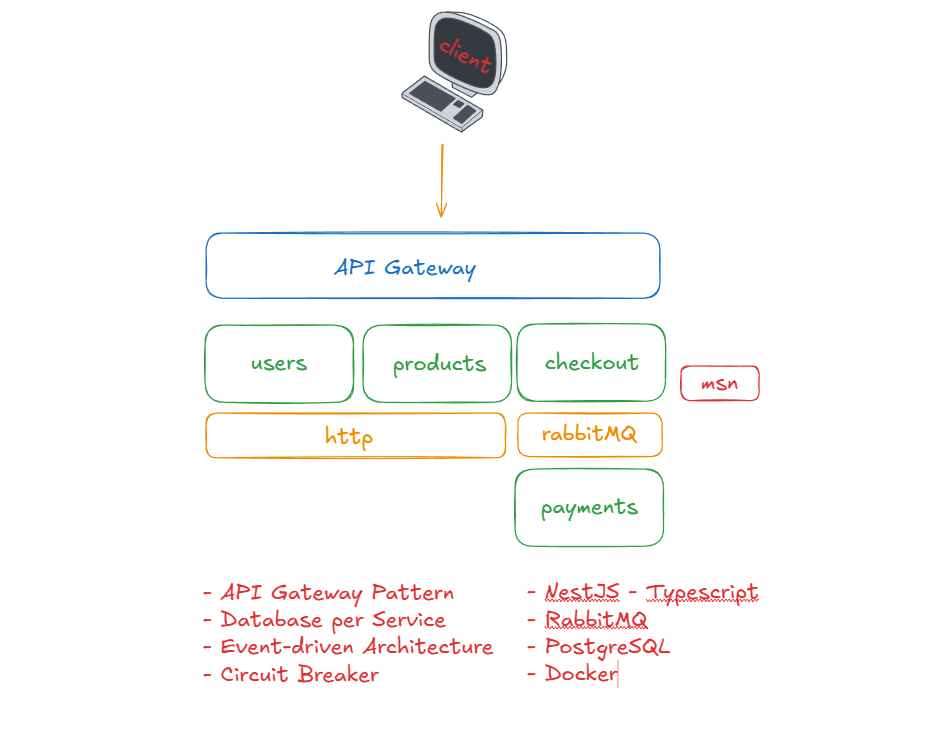

## Arquitetura 

  

## API Gateway e estrutura do projeto

  

# 🚀  Tecnologias Utilizadas

- **[NestJS](https://nestjs.com/)** - Framework para criação de aplicações backend escaláveis em Node.js
- **[TypeScript](https://www.typescriptlang.org/)** - JavaScript com tipagem estática
- **[PostgreSQL](https://www.postgresql.org/)** - Banco de dados relacional robusto e confiável
- **[TypeORM](https://typeorm.io/)** - ORM para integração com banco de dados relacional
- **HTTP/REST** - Padrão para construção de APIs e comunicação entre sistemas
- **[RabbitMQ](https://www.rabbitmq.com/)** - Sistema de mensageria para comunicação assíncrona
- **[JWT](https://jwt.io/)** - Autenticação baseada em token
- **[Bcrypt](https://www.npmjs.com/package/bcrypt)** - Biblioteca para criptografia de senhas
- **[Prometheus](https://prometheus.io/)** - Coleta de métricas da aplicação
- **[Grafana](https://grafana.com/)** - Visualização de métricas em dashboards
- **[OpenTelemetry](https://opentelemetry.io/)** - Monitoramento e rastreamento distribuído
- **[Docker](https://www.docker.com/)** - Plataforma de containerização
- **[Docker Compose](https://docs.docker.com/compose/)** - Gerenciamento de múltiplos containers
- **[Jest](https://jestjs.io/)** - Framework para testes automatizados
- **[ESLint](https://eslint.org/) + [Prettier](https://prettier.io/)** - Padronização e formatação de código
- **[VS Code](https://code.visualstudio.com/)** - Editor de código para desenvolvimento
